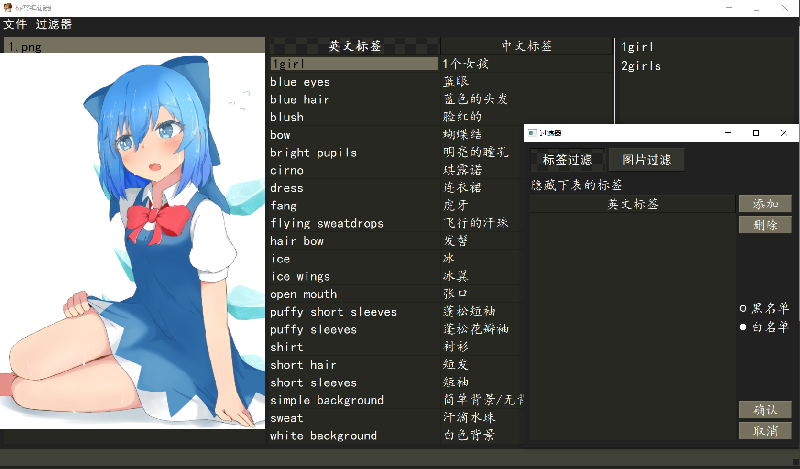
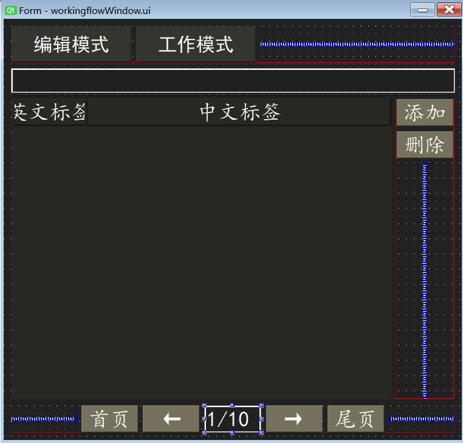

[中文文档](https://github.com/Aleiluo/danbooruTagEditor/blob/master/README_cn.md)

## Functions and Features
Easy to edit DanBooru tags for **single** images.

- Dark Monokai interface
- Useful shortcuts
- Copy list to cache used tags
- Basic filtering
- Undo Redo
- Whether to sort when saving



## Installation and startup

### Step1:
Installing pyqt5

``
pip install pyqt5
``

### Step2:

Run **start.bat**, or
```
python GUI.py
```

## Description of functions

### imageList

- Ctrl + S: save
- Alt + S: show/hide preview image
- Alt + Up (mouse up wheel): select previous image
- Alt + Down (mouse down wheel): select the next image
- Enter: focus on TagTable

### tagTable

- Ctrl + C: copy
- Ctrl + V: clipboard content overwrite selection
  - If first column is checked: overwrite English tags
  - If second column is checked: overrides translation
- Shift + V: add the contents of the clipboard to the table
- Del: Delete selected rows (multiple selections possible)
- Ctrl + Z: Undo
- Ctrl + Y: Redo
- Enter: Enter editing mode
- Esc: return to imageList

> Changing translation tag will automatically save the translation file

### copyList
CopyList records tags that are **added** or **modified** in tagTable.

- Left click: add the tag to tagTable
- Right-click: deletes

### Filter
can filter both tags and images

- Left: switch to tagfilter
- Right: switch to imagefilter
- Enter: add rows
- Del: delete rows
- Ctrl + Enter: Apply filter

### Other notes

### File format
- Images in the folder must be in **.jpg** or **.png** format.
- Each image corresponds to a **.txt** tagged document with the same name, and the tags within the document are separated by commas.

### Shortcut rewriting
MainWindowshortcuts are centered on interactive_events.
Filter shortcuts are centered on tagfilter.

## TODO

Add workflow to make adding tags more convenient. In the edit mode, multiple categories can be defined, and tags can be conveniently added in the work mode after the definition is completed. for example:
- Viewpoint (first page)
   - front
   - side
   - back
- Action (second page)
   - lie
   - stand
   - squat
- Head (third page)
   - Hair clips
   - hair accessories
   - Double tail
- Upper body (4th page)
   - skirt
   - T-shirts
- other parts...

The design of this function mainly considers the following reasons:
- On the basis of marking by tagger, the number of wrong or need to add tags for each part of the human body is small.
- When users add tags, they often have their own tag documents. This function can reduce the need for users to switch back and forth between tag documents and tagger.

