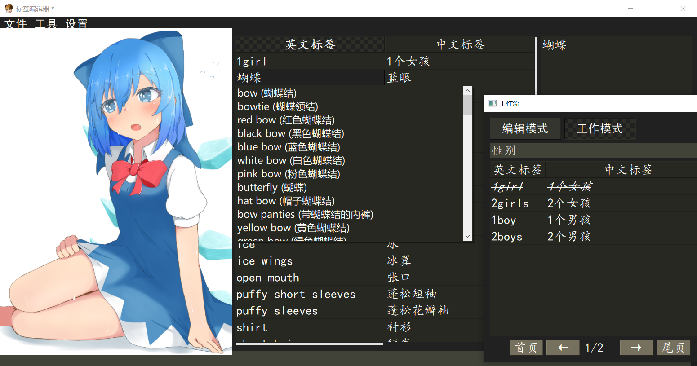
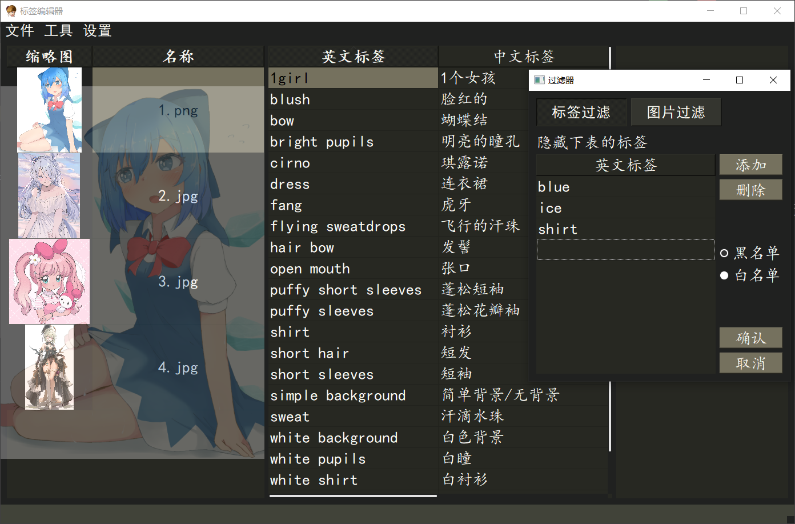

## 程序简介
一个针对**单张**图片的DanBooru标签精修小程序。

### 功能与特色
- 暗色Monokai界面
- 自动补全
- 撤销重做
- 黑白名单过滤器
- 标签工作流
- 标签保存时排序模式选择
- 多线程载入图片
- 缓存用过的标签





## 安装与启动

### 安装

```
git clone https://github.com/Aleiluo/danbooruTagEditor
```

### 启动

**Step1**：安装pyqt5

```
pip install pyqt5
```

**Step2**：运行程序

```
python GUI.py
```

> ps：我用Python3.9.13进行开发，其他能装上pyqt5的版本应该都能跑。

## 快捷键

### 图片列表
- Ctrl + S：保存
- Alt + S：显示/隐藏预览图
- Alt + Up（鼠标上滚轮）：选择上一张图片
- Alt + Down（鼠标下滚轮）：选择下一张图片
- Enter：进入标签表格

### 标签列表

- Enter：进入编辑模式
- Ctrl + N：添加新的行
- Ctrl + C：复制
- Ctrl + V：粘贴
  - 若选中第一列：覆盖标签
  - 若选中第二列：覆盖译文
- Shift + V：将剪贴板的的内容插入到表中
- Del：删除选中行
- Ctrl + Z：撤销
- Ctrl + Y：重做
- Esc：返回图片列表

> 更改翻译内容会自动保存翻译文件

### 拷贝列表
拷贝列表会记录在标签列表中**增加**或者**修改**的标签。

- 左键：将该行内容添加到标签列表中
- 右键：删除当前内容

### 过滤器
过滤器可以同时过滤标签和图片，注意图片过滤是针对图片拥有的标签，而不是图片名字。

- Left：切换到标签过滤
- Right：切换到图片过滤
- Enter：添加行
- Del：删除行
- Ctrl + Enter：应用过滤器

### 工作流
工作流分为编辑模式和工作模式。在编辑模式里，可以定义多个标签类别。在工作模式中可以便捷地按类别添加标签。

比如：
- 视角（第一页）
  - 正面
  - 侧面
  - 背面
- 动作（第二页）
  - 躺
  - 站
  - 蹲
- 头部（第三页）
  - 发夹
  - 发饰
  - 双马尾
- 上半身（第四页）
  - 短裙
  - T恤
- 其他部位...

**相关快捷键**

- Left / Right：切换页

其余快捷键均与**图片列表**和**标签列表**的类似。

### 自动补全

上下选择补全项，Tab进行补全，也可以按Enter或者鼠标点击(在工作流窗口中会有点小bug)。

## 其他说明

### 文件格式
- 文件夹中的图片必须是 **.jpg** 或者 **.png** 格式的。
- 每一张图片对应一个同名的 **.txt** 标签文档，文档内标签用逗号分隔。

## TODO

- 添加批量添加、删除功能
- 添加设置窗口，方便快捷键更换
